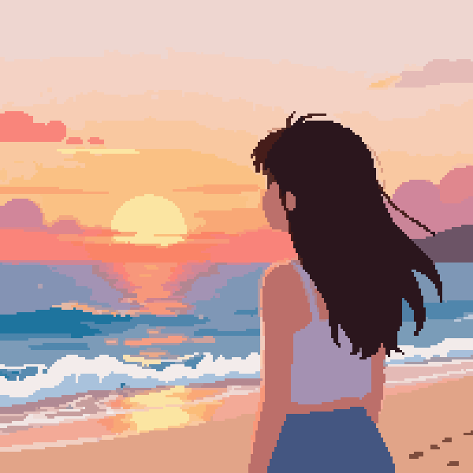
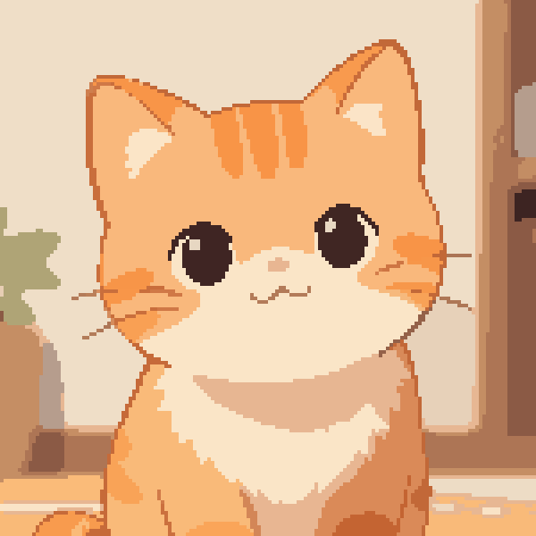
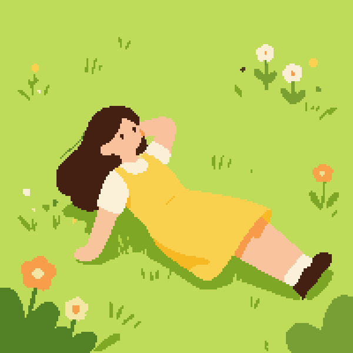

# Pixel Art Generator

Generates clean, grid-aligned pixel art from a text prompt via a four-step pipeline:

1. **Generate** — Z Image Turbo, Stable Diffusion, or whatever AI image model you want produces a flat, cartoon-style image
2. **Quantize** — Reduce to a limited color palette
3. **Vectorize** — Convert to SVG for clean, sharp geometry
4. **Pixelate** — Render SVG at your chosen resolution with pixel-snapped colors

This method avoids the grid-alignment and inconsistent-pixel-size problems common in directly AI-generated "pixel art."

This project can also be used as a image-to-pixel-art converter if you bring your own image and skip the AI image generation part.

## Gallery

These images were generated by this pipeline with the Z-Image-Turbo model, resized for display here.





## Setup

**Requirements:** Python 3.12+, Cairo

```bash
# System dependencies (one-time)
brew install python@3.12 cairo

# Create and activate virtual environment
python3.12 -m venv venv
source venv/bin/activate

# Install dependencies
pip install -r requirements.txt
```

---

## Usage

```bash
source venv/bin/activate
python3.12 cli.py "beautiful landscape, cartoon, flat"
```

The output lands in `./output/` — a `.png` pixel art file and a `.svg` vector file, both named with a timestamp.

### Options

| Flag | Default | Description |
|---|---|---|
| `--resolution`, `-r` | `200` | Output size in pixels (square) |
| `--colors`, `-c` | `32` | Number of colors in the palette |
| `--output`, `-o` | `output` | Output directory |
| `--input`, `-i` | — | Skip AI image generation: use this image file instead |
| `--model` | `CompVis/stable-diffusion-v1-4` | HuggingFace model ID |
| `--steps` | `30` | Inference steps for AI image generation (use 30 for stable diffusion models, 9 for Z-Image-Turbo) |
| `--guidance` | `10.0` | Guidance scale for AI image generation (use 5.0-15.0 for stable diffusion models, 1.0 for z-Image-Turbo) |
| `--save-intermediate` | off | Also save the raw and quantized images |

### Examples

```bash
# 150x150 image with a palette of 16 colors, with all intermediate steps saved
python3.12 cli.py "a cute anime orange kitten" -r 150 -c 16 --save-intermediate

# Skip AI image generation — vectorize and pixelate an existing image (much faster / less resource intensive)
python3.12 cli.py "my image" --input my_drawing.png -r 200 -c 32 --save-intermediate

# Use Z-Image-Turbo for a huge jump in quality (needs at least ~8 GB VRAM / RAM) (Works best with 9 steps and guidance 1.0)
python3.12 cli.py "a beautiful anime girl looking at a stunning beach sunset over cartoon waves, with beautiful cartoon clouds" --model Tongyi-MAI/Z-Image-Turbo --steps 9 --guidance 1.0
```

## Model notes

The default model (`CompVis/stable-diffusion-v1-4`) requires no HuggingFace login. It does not produce very good images by modern standards. For other options:

- `stabilityai/stable-diffusion-xl-base-1.0`: Maybe a little better quality but still not great, requires HuggingFace login
- `Tongyi-MAI/Z-Image-Turbo`: Recommended model and the one I've done the most testing with. Way better quality but heavier. Works well with 9 steps and guidance 1.0. Including words like `cartoon`, `anime`, `flat`, and `beautiful` in your prompt produces better pixel art.
